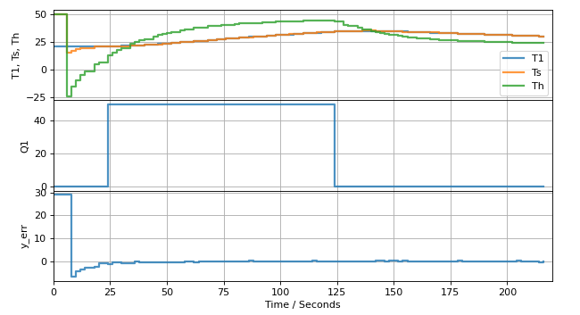
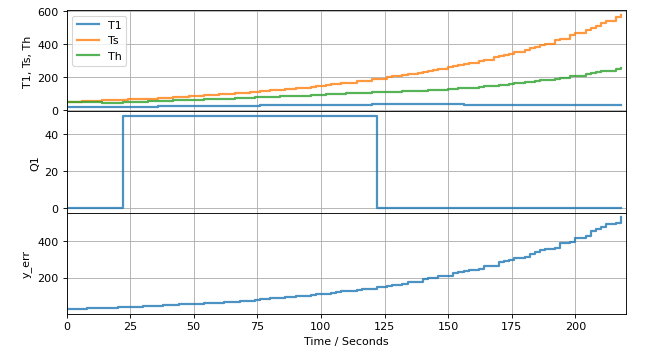

# Study Questions

**Study Question.** The following list of data sources has been specified for the tclab historian. `lab.T1` and `lab.T1` are current values of temperatures T1 and T2.

    `sources = [["T1", lambda: lab.T1], ["T_ave", lambda: (lab.T1 + lab.T1)/2], ["T2", lab.T2]]`
    
* How many sources are specifiied?
* One of these specification will result in an error. Which one. What is wrong? How would you fix it?
* Explain what is being done with the second data source.
* `lab.Q2` is a function defined so that executinig `lab.Q2()` returns a value. Specify a data source incorporating this function.
    
**Study Question.** Suppose you've written a novel control algorithm. The algorithm generates a floating point value that is denoted by the Python variable `y_est`. Given a list of data sources `sources`, add a source for this quantity with the tag "Y_EST".

**Study Question.** Suppose you have implemented a contrrol algorithm for a bioreactor application that utilizes a state space model. The state vector `x` has two elements representing temperature T and concentration C. Create a list of sources for the historian to record this data with tags "T" and "C".

**Study Question.** Suppose $x$ has five elements, $u$ has two elements, and $d$ has 1 element, and there is one process measurement. What are the dimensions of matrices $A$, $B_u$, $B_d$, and $C$?

**Study Question.** Someone has proposed a different model a temperature control device that includes heat transfer to the surround assembly. The model is written

$$
\begin{align}
C_{p,1}\frac{dT_1}{dt} & = U_a(T_2 - T_1) + Q_1  \\
C_{p,2}\frac{dT_2}{dt} & = U_a(T_1 - T_2) + U_b(T_{amb} - T_2)
\end{align}
$$

where $Q_1$ is the manipulable input, $T_2$ is measured, and $T_{amb}$ is an unmeasured external disturbance.

* Rewrite this model in state space form. Identify the components of $x$, $u$, $d$, and $y$. Write out matrices $A$, $B_u$, $B_d$, and $C$ specifying all of the coefficients.
* What are the units of $Q_1$ in this model?

**Study Question.** For a system with 2 states and 1 measurement, what is the dimension of the matrix $L$? 

**Study Question.** For the same system, what is the dimension of the product $LC$?

**Study Question.** Suppose you are given numerical values for $A$, $L$, and $C$, how could you determine if the observer will be stable?

**Study Question.** The following charts test the performance of two different observers for the same system consisting of a single heater/sensor assembly. T1 is the measured temperature, Ts is the estimated sensor temperature, Th is the estimated heater temperature.

<<<<<<< Updated upstream

=======

>>>>>>> Stashed changes

* Which of these is showing the useful result? Be sure you can explain why one is acceptable and one is not.
* For the one that is not performing, what has gone wrong? How you propose to fix the problem?
* Data for A, L, and C are available. What calculation would you perform to verify your analysis?  What calculation would you perform to remedy the problem? Be sure you can write out the code (no more than five lines required) to do these calculations.
